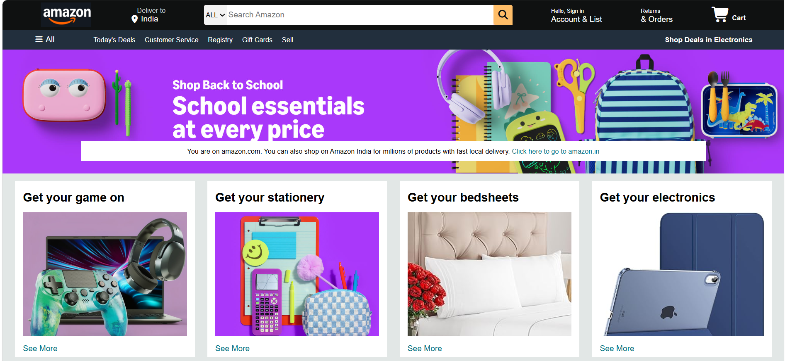
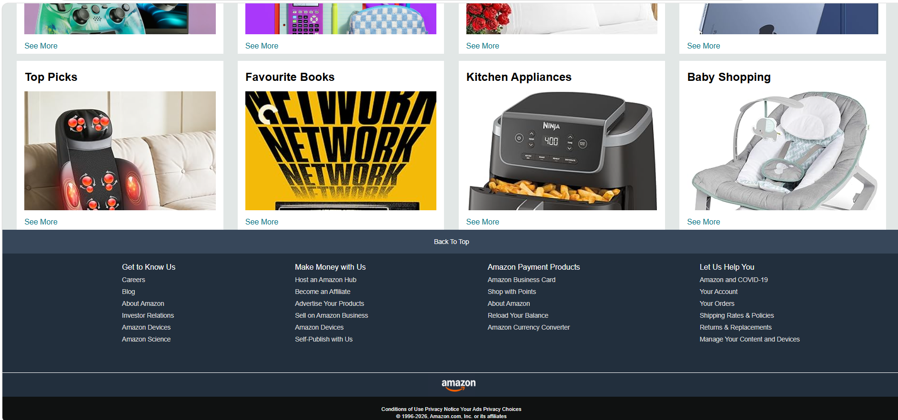
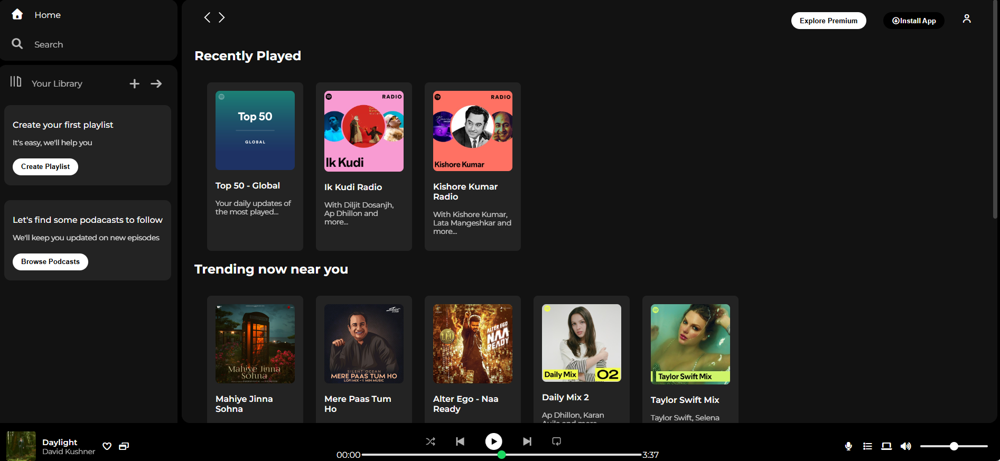
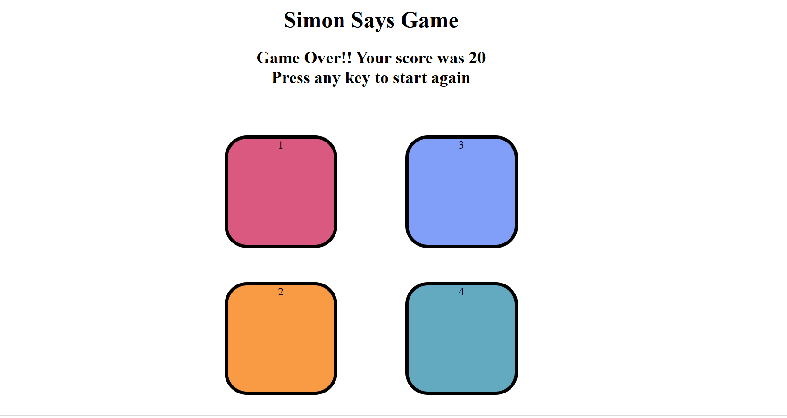
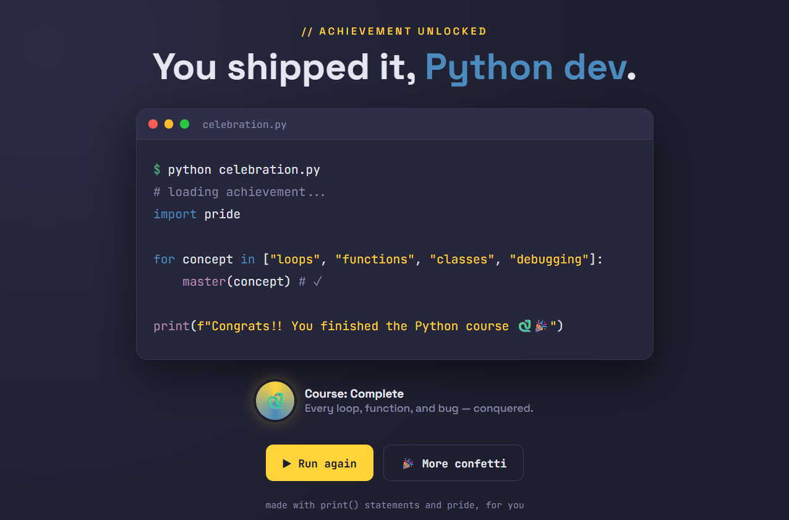
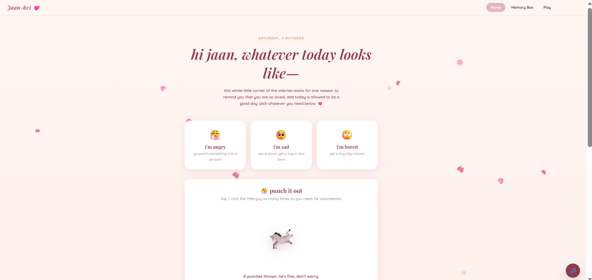
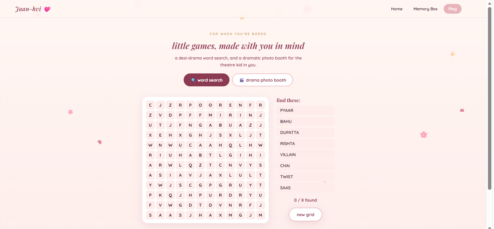
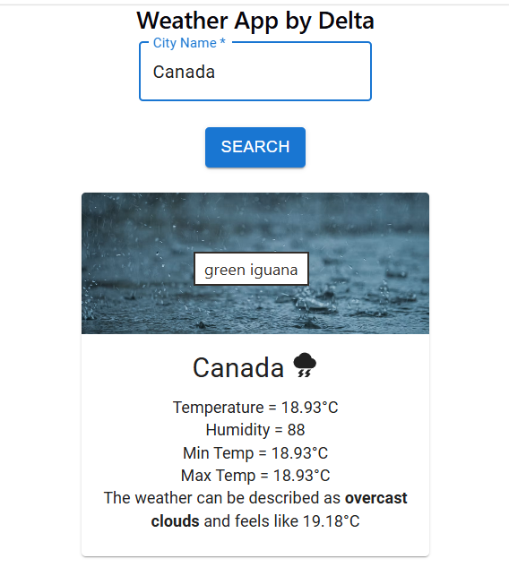
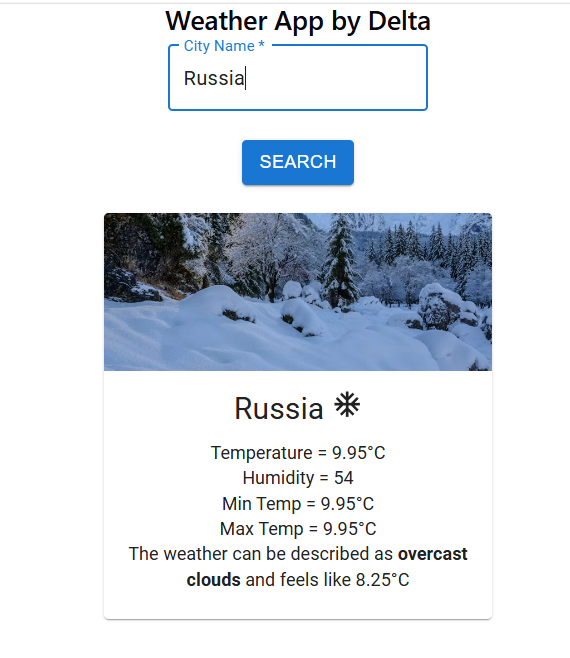
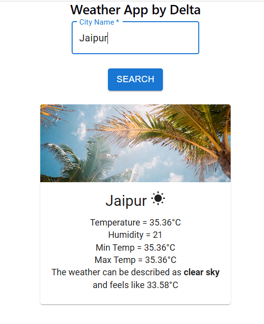

<div align="center">

# Web Development Projects

A portfolio of projects spanning **full-stack applications**, **React**, and **vanilla HTML/CSS/JavaScript** : from pixel-accurate UI clones to interactive games and live deployed products.


</div>

---

## ⭐ Featured Full-Stack Projects

My two major projects live in their own repositories, each with a live deployment and a detailed README.

<table>
<tr>
<td width="50%" valign="top">

### ⚙️ MechVerse
An academic companion for Mechanical Engineering students: semester-wise resource hub, grade planner, lab companion and SGPA calculator.

<a href="https://github.com/Midushii/MechVerse"></a>

**Stack:** Node.js · Express · PostgreSQL (Neon) · JWT · Vanilla JS

[🌐 Live Demo](https://mechverse-igdtuw.vercel.app/) · [📂 Repository](https://github.com/Midushii/MechVerse)

</td>
<td width="50%" valign="top">

### ✈️ WanderLust
An Airbnb-inspired stay-listing platform with listings CRUD, search, category filters, star reviews and owner-only access control.

<a href="https://github.com/Midushii/WanderLust"></a>
<br>
<br>

**Stack:** Node.js · Express · MongoDB · Passport.js · Cloudinary · EJS


[🌐 Live Demo](https://wanderlust-wtus.onrender.com/listings) · [📂 Repository](https://github.com/Midushii/WanderLust)

</td>
</tr>
</table>

---

## Projects in This Repository

| # | Project | Type | Tech |
|:-:|---|---|---|
| 1 | [Amazon Clone](#1-amazon-clone) | UI clone | HTML · CSS |
| 2 | [Spotify Clone](#2-spotify-clone) | UI clone | HTML · CSS |
| 3 | [Photography Club Page](#3-photography-club-page) | Landing page | HTML · CSS |
| 4 | [Simon Says Game](#4-simon-says-game) | Game | HTML · CSS · JS |
| 5 | [Python Celebration Page](#5-python-celebration-page) | Interactive page | HTML · CSS · JS |
| 6 | [Personalized Friend Site](#6-personalized-friend-site) | Multi-page site | HTML · CSS · JS |
| 7 | [React Weather App](#7-react-weather-app) | React app | React · Vite · MUI · API |

---

### 1. Amazon Clone
A responsive recreation of the Amazon India home page: header with search bar, hero banner, product category cards and a multi-column footer.

📂 [`1_Amazon-Clone`](1_Amazon-Clone) · **HTML5, CSS3** (Flexbox, Grid)

<p align="center">
  
  
</p>

---

### 2. Spotify Clone
A Spotify Web Player interface with sidebar navigation, library panel, "Recently Played" and "Trending" card grids, and a bottom playback control bar.

📂 [`2_Spotify-Clone`](2_Spotify-Clone) · **HTML5, CSS3** (dark theme, card layout)

<p align="center">
  
</p>

---

### 3. Photography Club Page
A moody full-screen landing page for a photography club, with a slide-in navigation menu covering Gallery, Exhibits, Events, Store, Contact and Feedback.

📂 [`3_Photography-Club-Page`](3_Photography-Club-Page) · **HTML5, CSS3** (background imagery, icon navigation)

<p align="center">
  
</p>

---

### 4. Simon Says Game
A memory game: watch the colour sequence flash, then repeat it. Every level adds one more step, and the game ends with your score on a wrong press. Press any key to start.

📂 [`4_Simon-Says-Game`](4_Simon-Says-Game) · **HTML5, CSS3, JavaScript** (DOM events, game state, `setTimeout` animations)

<p align="center">
  
</p>

---

### 5. Python Celebration Page
A "course complete" page with a terminal-style window that types out a Python script line by line, plus **Run again** and **More confetti** buttons.

📂 [`5_Python-Celebration-Page`](5_Python-Celebration-Page) · **HTML5, CSS3, JavaScript** (typing animation, syntax-highlighted output)

<p align="center">
  
</p>

---

### 6. Personalized Friend Site
A three-page gift website made for a friend: a mood-based **Home**, a **Memory Box** of photos, and a **Play** page with a desi-drama word search and a photo booth.

📂 [`6_Personalized-Friend-Site`](6_Personalized-Friend-Site) · **HTML5, CSS3, JavaScript** (multi-page navigation, shared stylesheet and script, interactive games)

<p align="center">
  
  
</p>

---

### 7. React Weather App
A weather app where you search any city and get live temperature, humidity, min/max temperature and conditions. The card image and icon change with the weather (rain, snow, sunny).

📂 [`7_react-weather-site/react-project`](7_react-weather-site/react-project) · **React 19, Vite, Material UI, OpenWeatherMap API** (components, props, `useState`, async `fetch`, error handling)

<p align="center">
  
  
  
</p>


---

## Skills Demonstrated

| Area | What these projects show |
|---|---|
| **Frontend** | Semantic HTML, responsive CSS (Flexbox/Grid), animations, DOM manipulation |
| **React** | Components, props, state hooks, API integration, Material UI |
| **Backend** | REST APIs, authentication (JWT, Passport), validation, MVC *(MechVerse, WanderLust)* |
| **Databases** | PostgreSQL (Neon), MongoDB (Atlas) |
| **Deployment** | Vercel, Render |

---

## Getting Started

```bash
git clone https://github.com/Midushii/web-development-projects.git
cd web-development-projects
```

Projects 1–6 are static: open the folder's `index.html` in a browser (or use the VS Code **Live Server** extension). Project 7 is a Vite app.

---

## Developer

**Midushi Maheshwari**
B.Tech. Electronics and Communication Engineering (AI), IGDTUW

[GitHub](https://github.com/Midushii) · [midushi.maheswari@gmail.com](mailto:midushi.maheswari@gmail.com)

<div align="center">

---

⭐ If you found these projects useful, consider starring the repo!

</div>
